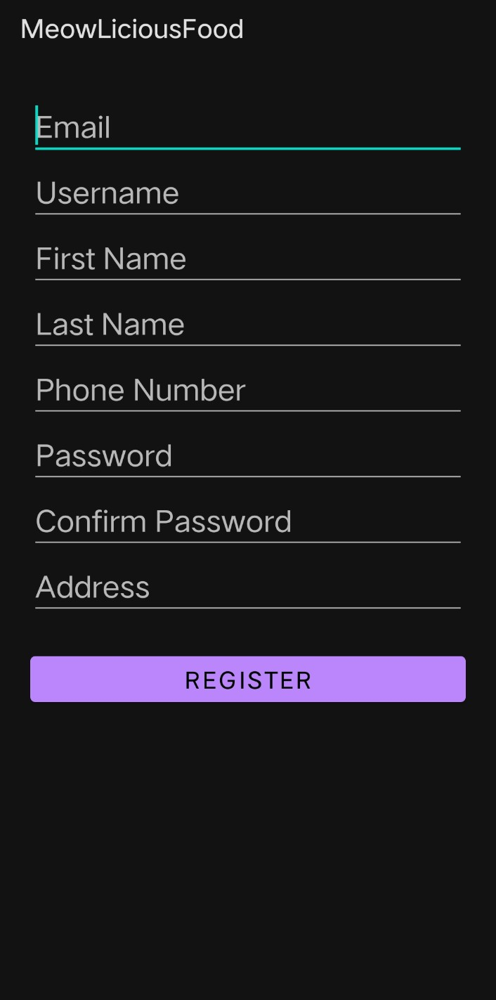
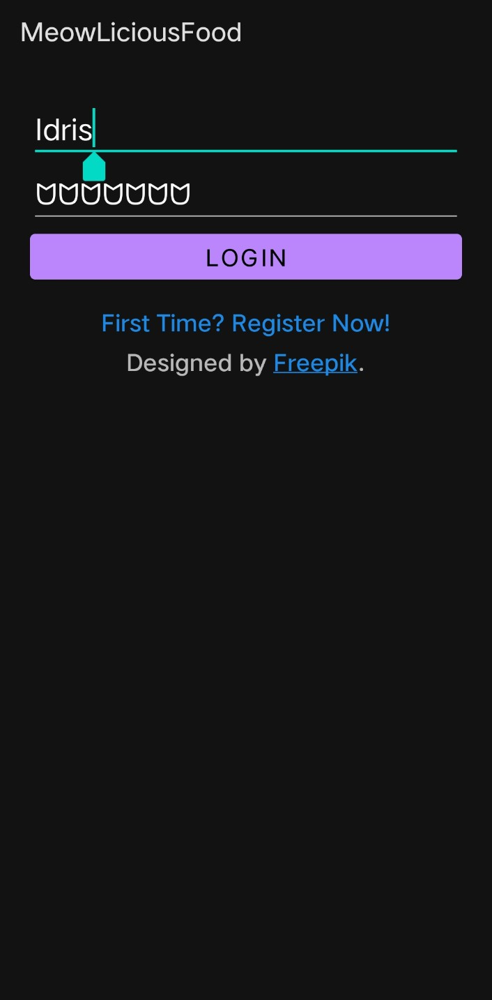
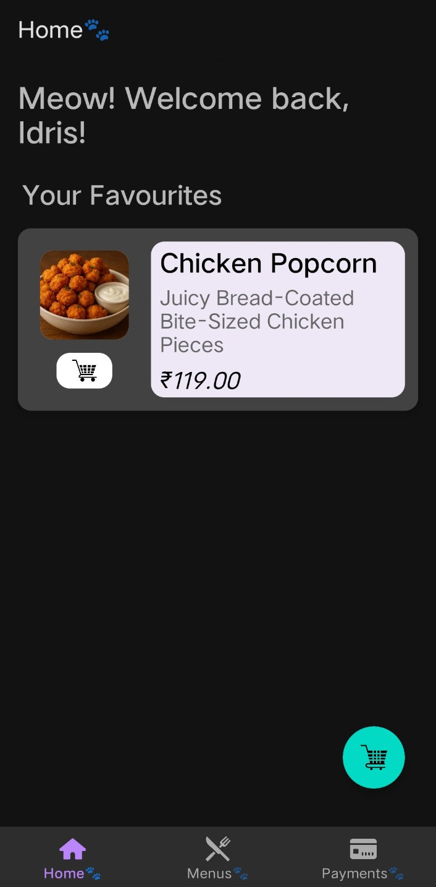
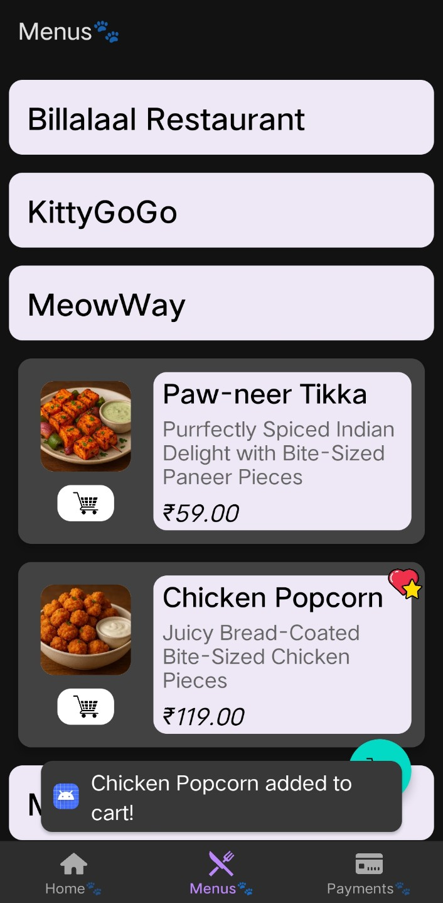
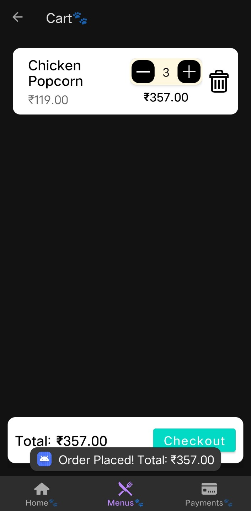

# 🐾 MeowLiciousFood

> A cat-themed food delivery learning project. Android (MVVM) app + Node.js + MySQL backend.  
> Built for learning full-stack development, architecture patterns, and app-server integration.  
> **Work in progress! Not yet fully ready.** </br>

## Showcase







## Overview

**MeowLiciousFood** is a fun, educational full-stack application that combines a mobile Android frontend with a Node.js + MySQL backend.

I explored:
- MVVM architecture in Android (Java)
- XML scripting (**Majorly AI assisted**, so apologies for any bad scripting if present)
- REST API consumption using Retrofit (https://github.com/square/retrofit)
- Serialization/De-Serialization using google GSON
- Backend API design with Node.js and Express; explored async, await
- Hashing with bcrypt (default Salt Hashing Algorithm), image compression with sharp
- Database persistence using MySQL add-on on Clever-Cloud
- MySQL Joins, Nested Queries, Stored Procedures, Views and Triggers
- Hosting on Vercel

**All coded in Notepad, with Powershell assist**

The app and backend are still under development, roughly 50% complete with no Payments implementation, but demonstrate a working client-server setup for a food ordering experience.

Hosting done at: **[meow-licious-food.vercel.app](https://meow-licious-food.vercel.app)** </br>
UI icons/images: **[Freepik](https://freepik.com)**, and **ChatGPT** (for Menu Items) </br>
Attribution to icons/images authors on Freepik: **Optima GFX**, **~Artist**, **CuputoCreative**, **Freepik**, **Joninovianto77**, **Sangpejuang**, **Dinosoftlab**, **Smashicons** 

## Repository Structure (Core Components)

```text
MeowLiciousFood/
├── backend/
│   ├── package.json
│   ├── package-lock.json
│   ├── server.js
│   └── db.js
│
├── frontend/
│   ├── build.gradle
│   ├── gradle.properties
│   ├── settings.gradle
│   ├── gradlew
│   |
│   ├── app/
│   |   ├── build.gradle
│   |   ├── lint-baseline.xml
│   |   ├── proguard-rules.pro
│   |   └── src/
│   |       └── main/
│   |           ├── AndroidManifest.xml
│   |           |
│   |           ├── java/com/example/restapplication
│   |           |   ├── CustomPasswordTransformation.java
│   |           |   ├── LoginActivity.java
│   |           |   ├── MainActivity.java
│   |           |   ├── RegisterActivity.java
│   |           |   ├── Refreshable.java
│   |           |   ├── SessionManager.java
│   |           |   |
│   |           |   ├── ui/
│   |           |   |   ├── FavoritesStore
│   |           |   |   ├── LastItemBottomOffsetDecoration.java
│   |           |   |   ├── LastItemOffsetProvider.java
│   |           |   |   |
│   |           |   |   ├── home/
│   |           |   |   |   ├── HomeFragment.java
│   |           |   |   |   ├── HomeViewModel.java
│   |           |   |   |   └── HomeAdapter.java
│   |           |   |   |
│   |           |   |   ├── menus/
│   |           |   |   |   ├── MenusFragment.java
│   |           |   |   |   ├── MenusViewModel.java
│   |           |   |   |   ├── MenusAdapter.java
│   |           |   |   |   ├── MenusCache.java
│   |           |   |   |   ├── MenuItem.java
│   |           |   |   |   ├── RestaurantViewHolder.java
│   |           |   |   |   |
│   |           |   |   |   └── cart/
│   |           |   |   |       ├── CartFragment.java
│   |           |   |   |       ├── CartManager.java
│   |           |   |   |       ├── CartAdapter.java
│   |           |   |   |       └── CartItem.java
│   |           |   |   |
│   |           |   |   └── payments/
│   |           |   |       ├── PaymentsFragment.java
│   |           |   |       └── PaymentsViewModel.java
│   |           |   |
│   |           |   └── backendlink/
│   |           |       ├── APIService.java
│   |           |       ├── RetrofitClient.java
│   |           |       ├── User.java
│   |           |       ├── RegisterUser.java
│   |           |       ├── OrderRequest.java
│   |           |       ├── OrderItemRequest.java
│   |           |       ├── OrderUtils.java
│   |           |       ├── FavoritesRequest.java
│   |           |       ├── LoRResponse.java
│   |           |       ├── OrderResponse.java
│   |           |       ├── FoodItemResponse.java
│   |           |       └── FavoritesResponse.java
│   |           |
│   |           └── res/
│   |               ├── drawable/...
│   |               ├── layout/...
│   |               ├── menu/...
│   |               ├── navigation/...
│   |               ├── values-night/...
│   |               ├── values/...
│   |               └── xml/...
│   |
│   └── gradle/...
│
├── LICENSE
└── README.md   
```
